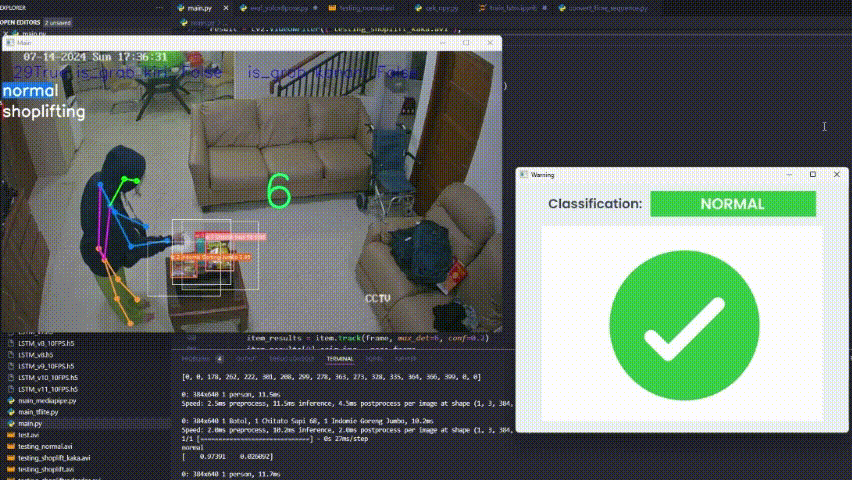

# Shoplifting (Hiding Items) Activity Detection System Based on Human Skeleton Estimation, Object Detection, and Time Series Classification  
In classifying an action, we cannot only use the spatial data at one time, but we also need the data in the previous state (temporal aspect). 
In this project, the spatial data will be represented by the pose estimation result and the object detection data of the item being held by the subject. 
Those spatial data will then be represented in a sequential time series manner, which will be inputted to a LSTM classification model.
## Shoplifting

## Normal

